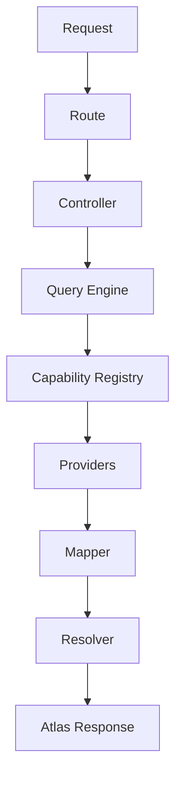

# Architecture

Atlas is designed with modularity and extensibility in mind. Each request flows through a series of orchestrated components, ensuring consistency, reliability, and transparency.

## Request Flow

### Components Explained

- **Route:** Maps HTTP requests to controllers.
- **Controller:** Handles request validation and response formatting.
- **Query Engine:** Orchestrates multi-provider execution for a given capability.
- **Capability Registry:** Tracks which providers support which domains/capabilities.
- **Providers:** Implement the Provider interface for each data source.
- **Mapper:** Normalizes provider-specific data into Atlas models.
- **Resolver:** Merges, deduplicates, and enriches results from multiple providers.
- **Atlas Response:** The final, normalized, and attributed response sent to the client.

## Example
A search for "mars" flows through all these layers, aggregating data from NASA, JPL, and Le Système Solaire, and returning a unified result.

> **Note:** The architecture is designed for easy extension—add new providers or domains with minimal changes.
